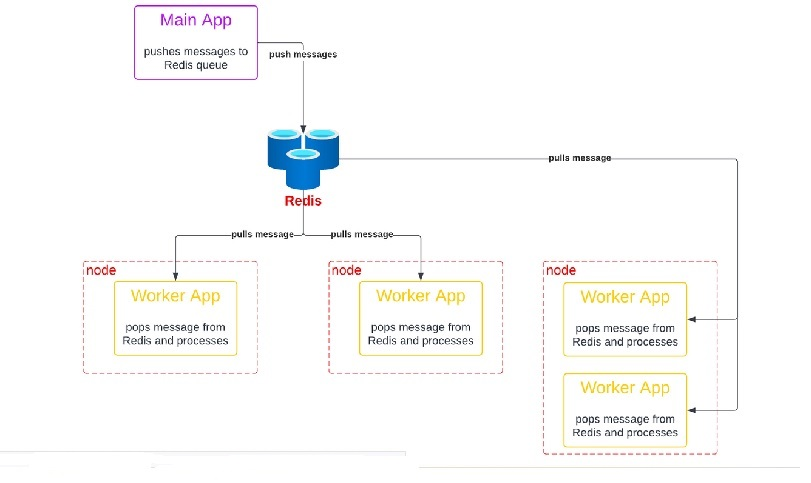

# virtualenv
 * py -3 -m venv venv

# Distributed computation system using redis

# Running things
 * docker compose run redis redis-cli -h redis -a secret -n 0
   * ping - should get PONG response
   * keys * - lists out all keys in Redis - initially this should be empty, but once we start our main app, we should see one entry for our queue (key should be demo-1)
   * lrange demo-1 0 -1 - this lists our all the messages in the queue (a Redis list)
   